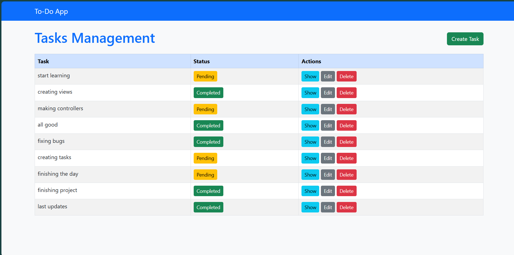
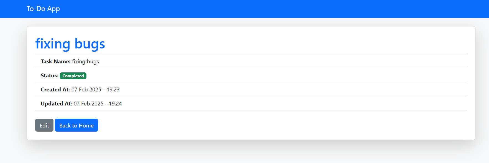

# Laravel To-Do App




## Description

This is a simple To-Do application built with Laravel. It allows users to create, update, and delete tasks. Tasks are dynamically updated with a status (completed or pending), and the app provides a user-friendly interface for task management.

## Features

- **User Authentication**: Users can register, log in, and manage their tasks.
- **Create Tasks**: Users can create new tasks with a title and description.
- **Update Task Status**: Tasks can be marked as completed or pending.
- **Delete Tasks**: Users can delete tasks from their to-do list.
- **Task List**: A view to display all tasks, with status and options to update or delete.

## Installation

### Prerequisites

Make sure you have the following installed on your system:
- PHP >= 7.4
- Composer
- Laravel
- MySQL (or your preferred database)

### Steps

1. **Clone the repository**:
   ```bash
   git clone https://github.com/Mohammedali03/To_Do-App.git

details of a task section 


