Momentum

Welcome to Momentum, a powerful tool designed to help users efficiently manage their tasks, track progress, and optimize productivity with a user-friendly experience.

Features

🚀 A Nice Welcome Page

A visually appealing welcome page that introduces the platform and its features.

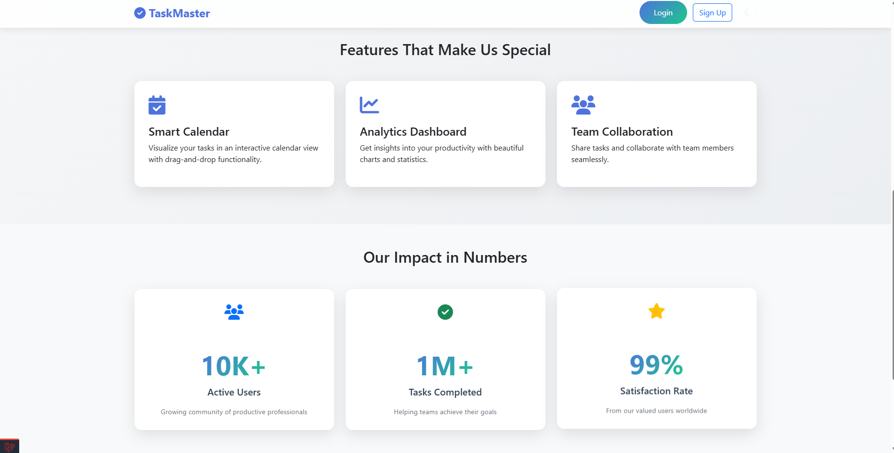

🎨 User-Friendly Interface with Theme Toggle

An intuitive dashboard that allows users to manage tasks with ease, including a theme toggle for light and dark modes.
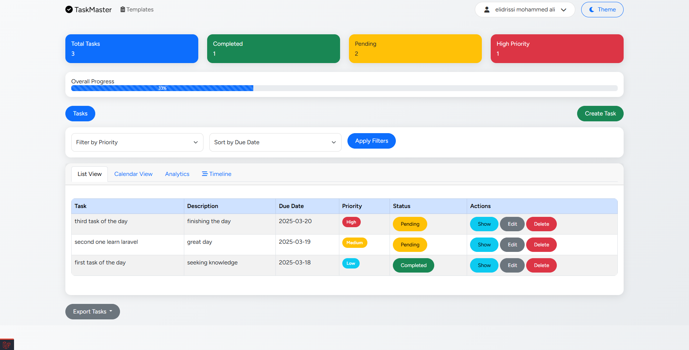

✅ Task Management (CRUD & Filtering)

List all tasks in an organized view
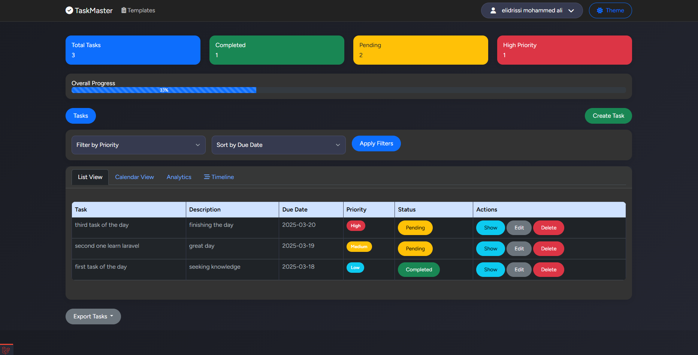

Perform actions: Show, Edit, Delete
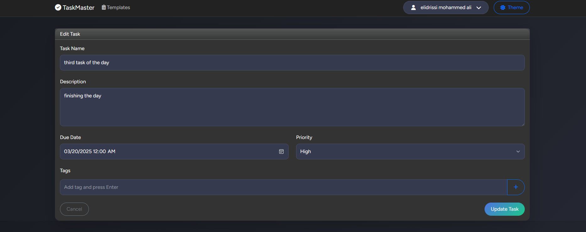
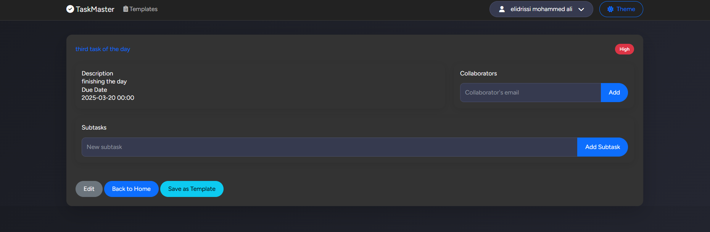

Apply filters to find specific tasks quickly

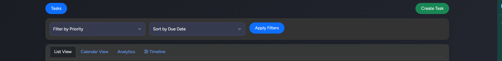

📊 Overall Progress Bar

A dynamic progress bar displaying the percentage of completed tasks for an at-a-glance productivity overview.

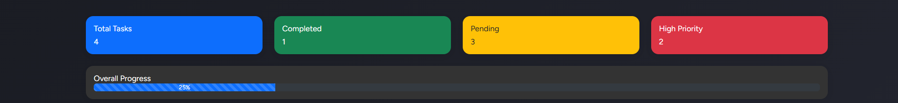

📅 Calendar Integration

A built-in calendar to view and manage tasks based on their deadlines and schedules.

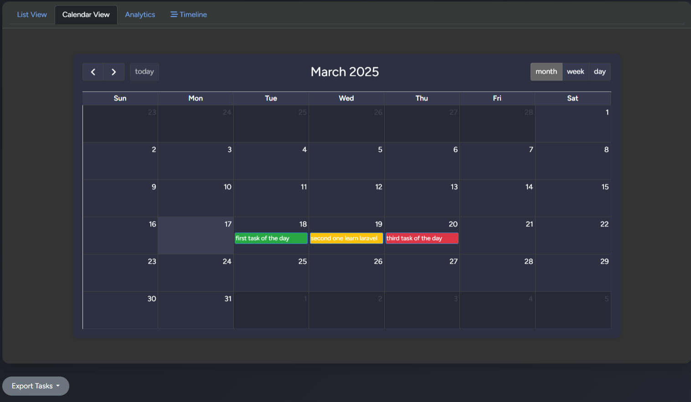

📈 Analytics for Task Completion

Comprehensive analytics to track task completion rates and identify productivity patterns.

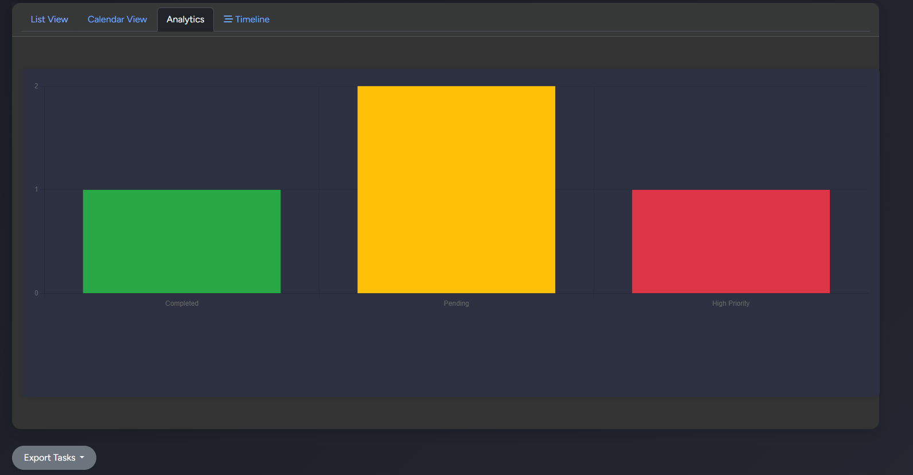

📌 Timeline for Tasks

A structured timeline view to visualize task progress over time.

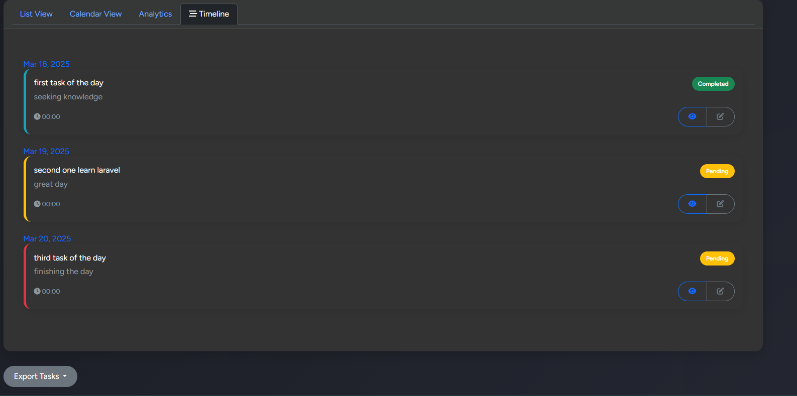

📂 Save Task Templates

A feature to save and reuse task templates for recurring workflows, making task creation more efficient.

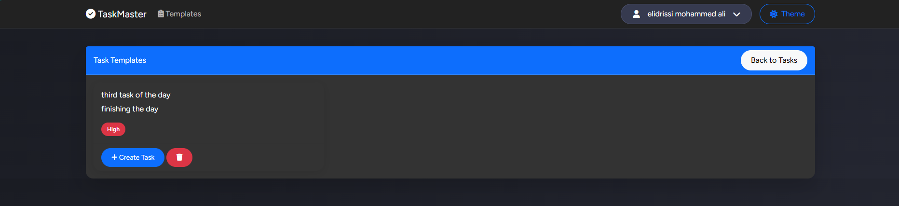

⚙️ Profile Settings & Customization

Users can personalize their experience with profile settings, including display preferences and account management.

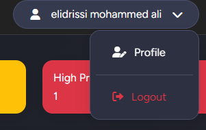

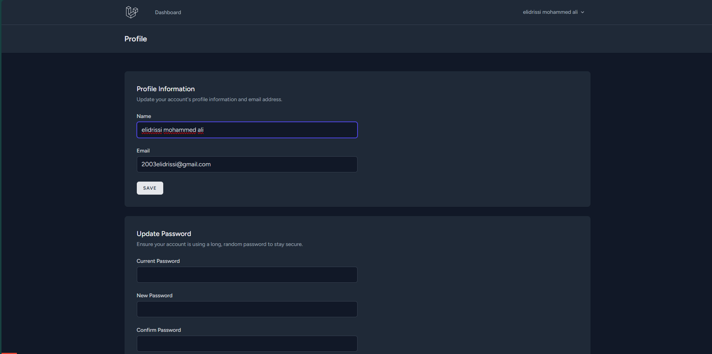

Installation & Setup

Prerequisites

PHP 8+

Composer

Node.js & npm

MySQL or any supported database

Steps

         # Clone the repository
         git clone https://github.com/Mohammedali03/Momentum.git
         
         # Navigate to the project folder
         cd momentum
         
         # Install PHP dependencies
         composer install
         
         # Install JavaScript dependencies
         npm install  # or yarn install
         
         # Copy the environment file
         cp .env.example .env
         
         # Generate the application key
         php artisan key:generate
         
         # Configure the database in .env file
         # Then run migrations and seeders
         php artisan migrate --seed
         
         # Run the application
         php artisan serve & npm run dev

Contribution

Feel free to contribute to this project by submitting issues, feature requests, or pull requests.

License

This project is licensed under the MIT License.

✨ Happy Task Managing! 🚀

